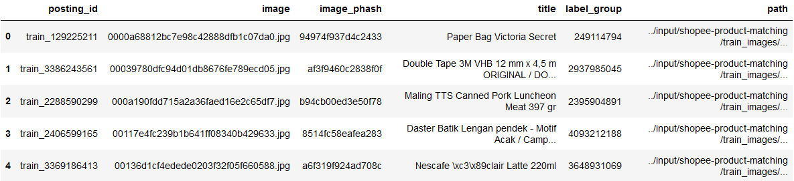
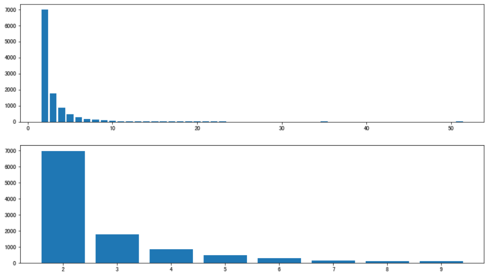
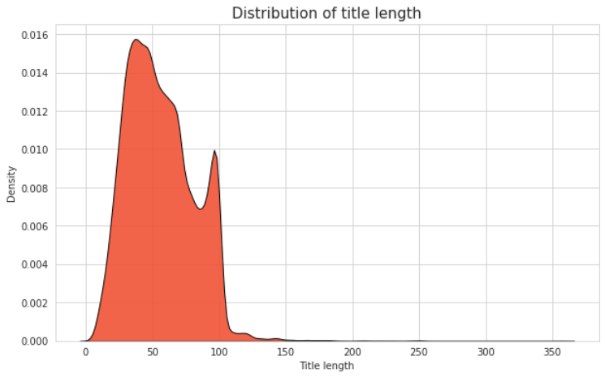
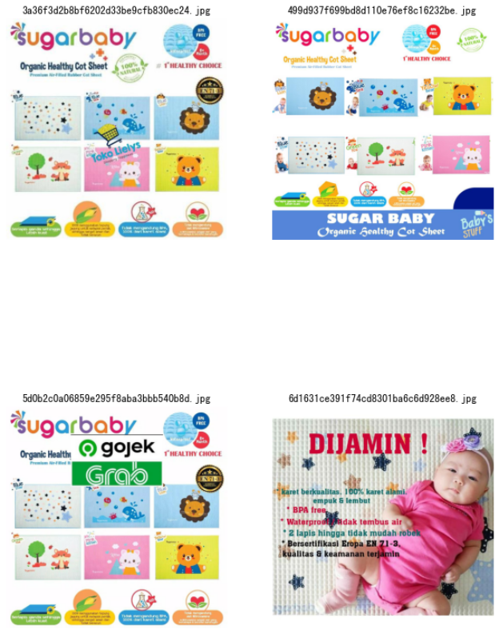

## 数据分析

```python
train = pd.read_csv('../input/shopee-product-matching/train.csv')
test = pd.read_csv("../input/shopee-product-matching/test.csv")
WORK_DIR = '../input/shopee-product-matching'
train_images = WORK_DIR + "/train_images/" + train['image']
train['path'] = train_images
train.head()
```



```python
x=train['label_group'].value_counts()
x1=x[x<10]
y=x.value_counts().reset_index()
y1=x1.value_counts().reset_index()
plt.figure(figsize=(14,8))
plt.subplot(211)
plt.bar(y['index'],y['label_group'])
plt.grid(False)
plt.subplot(212)
plt.bar(y1['index'],y1['label_group'])
plt.grid(False)
plt.show()
plt.savefig()
```



```python
sns.set_style("whitegrid")
plt.figure(figsize = (10, 6))
plt.title('Distribution of title length', fontsize = '15')
sns.kdeplot(train['title'].apply(lambda x: len(x)), fill = True, 
            color = '#f15335', 
            edgecolor = 'black', alpha = 0.9)
plt.xlabel('Title length')
plt.show()
```



+ image_phash相同，图片差距较小

```python
sample_image_path = train.loc[train["image_phash"] == "d0c0ea37bd9acce0", "image"].values
plt.figure(figsize = (10, 15))
for idx, i in enumerate(sample_image_path[[0,1,7,9,15,17,18,19]]):
    plt.subplot(4, 2, idx + 1)
    image_viz("../input/shopee-product-matching/train_images/" + i)
    plt.title(i)
    print(i)
plt.show()
```


+ 同一件商品的不同图片

```python
group1 = train[train['image_phash'] == 'fad28daa2ad05595']
print(group1.shape)
group2 = train[train.label_group == 997220911]
print(group2.shape)
extra_image = [img_path for img_path in group2.image.tolist(
) if img_path not in group1.image.tolist()]
print(extra_image)
plt.figure(figsize = (10, 15))
for idx, i in enumerate(extra_image):
    plt.subplot(2, 2, idx + 1)
    image_viz("../input/shopee-product-matching/train_images/" + i)
    plt.title(i)
plt.show()
```




