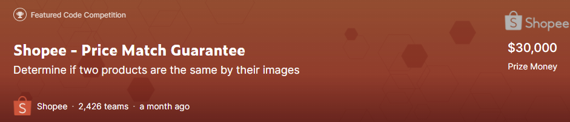
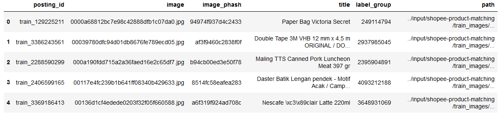
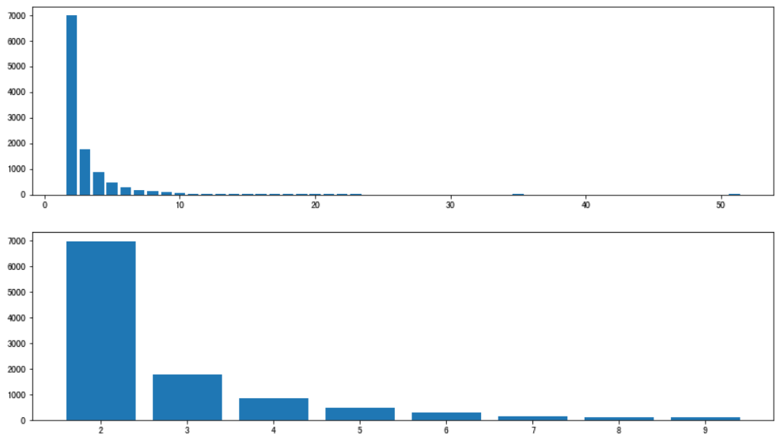
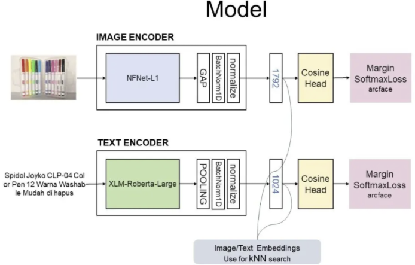
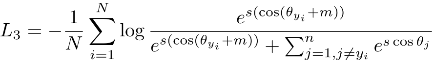

## Shopee - Price Match Guarantee

> 本次比赛的任务是给定一件商品，利用机器学习算法在数据集中寻找与之相同的商品。主要的特征包括图片，标题，image_phash（phash可以度量两张图片的相似程度）。同一件商品可以有完全不同的图片与标题，同一张图片也可能代表着不同的商品。此任务可以看作一个多模态检索任务，利用图像与文本信息检索出相同的商品

### 数据介绍

+ label_group相同，表示属于同一个商品。训练集中一共有11014个不同商品。每个商品包含样本数量如下图所示，每个相同商品最多包括51个样本（不同的posting_id），每个商品包含两个样本最常见。

+ 更多的数据介绍参考[这里](https://github.com/BITprogramMan/kaggle_shopee/blob/master/data_analysis.md)

### 评价指标

+ 平均F1分数

### 模型

#### image model

+ Efficient
+ eca_nfnet

#### text model

+ BERT家族

> 使用两大类模型分别得到image与text的embedding，然后使用KNN根据embedding的距离检索相同的商品

#### 损失函数

+ ArcFace

> Additive Angular Margin Loss（ArcFace），以加法的方式惩罚深度特征与其相应权重之间的角度，从而同时增强了类内紧度和类间差异。可以理解为正则化的softmax

### 融合模态信息

+ 分别使用image embedding与text embedding检索相同的商品，然后将两个结果聚合
+ 将image embedding与text embedding连接，形成多模态embedding，然后检索商品

+ 聚合前两种方法的结果

> 第二种方法的结果优于第一种方法的结果，第三种方法结果优于第二种方法的结果

### 迭代结果聚合

> 基于QE(Query Expansion)和 DBA(DataBase Augmentation)的思路，作者实现步骤如下：

+ 步骤1：使用`fassi`完成内积计算，得到Top50个待选商品。

- 步骤2：对待选商品加入相似度标记。
- 步骤3（动态阈值调整）：根据赛题匹配组大小规律，每组肯定有2个或2个以上商品，所以根据匹配商品数量调整匹配和阈值。
- 步骤4（Neighbor Blend）：基于上述匹配的商品组构建商品相似图，其中节点为具体商品，边为商品之间的相似度。

[参考资料：https://www.kaggle.com/c/shopee-product-matching/discussion/238136](https://www.kaggle.com/c/shopee-product-matching/discussion/238136)

test!!!

